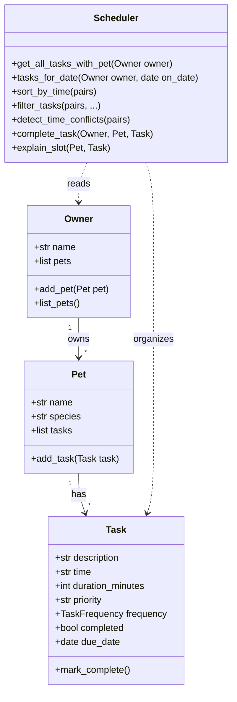
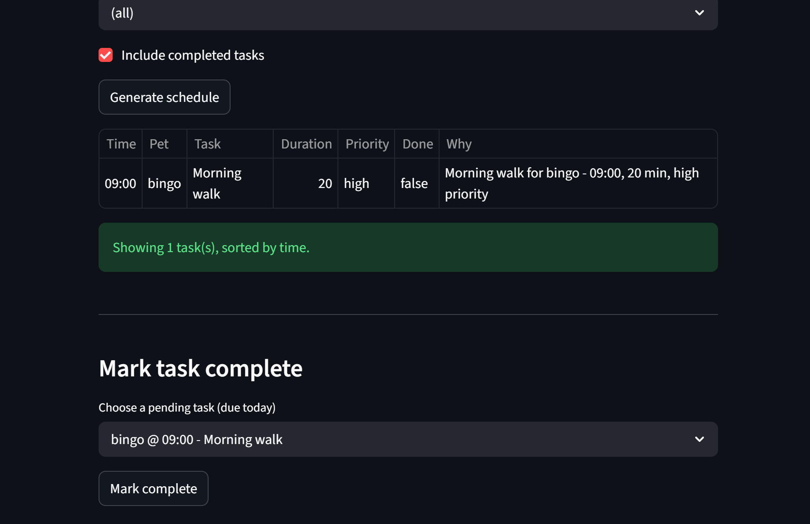

# PawPal+ (Module 2 Project)

You are building **PawPal+**, a Streamlit app that helps a pet owner plan care tasks for their pet.

## Scenario

A busy pet owner needs help staying consistent with pet care. They want an assistant that can:

- Track pet care tasks (walks, feeding, meds, enrichment, grooming, etc.)
- Consider constraints (time available, priority, owner preferences)
- Produce a daily plan and explain why it chose that plan

Your job is to design the system first (UML), then implement the logic in Python, then connect it to the Streamlit UI.

## What you will build

Your final app should:

- Let a user enter basic owner + pet info
- Let a user add/edit tasks (duration + priority at minimum)
- Generate a daily schedule/plan based on constraints and priorities
- Display the plan clearly (and ideally explain the reasoning)
- Include tests for the most important scheduling behaviors

## Architecture (UML)



- **PNG for submission:** [`uml_final.png`](uml_final.png) — class diagram export (same content as the Mermaid block below).
- **Optional vector file:** [`uml_final.svg`](uml_final.svg) — if Windows does not open it, **drag the file into Chrome or Edge**, or use **Open with → a browser**.

## Features

- **Owner and pets** — Register an owner name and multiple pets (species tag).
- **Tasks** — Each task has a description, clock time (`HH:MM`), duration, priority, optional **once / daily / weekly** recurrence, due date, and completion flag.
- **Scheduler** — Collects tasks through `Owner` → `Pet`, filters by date/pet/completion, **sorts by time**, and emits **same-time conflict** warnings (exact clock match).
- **Recurring tasks** — Completing a daily or weekly task via `Scheduler.complete_task` appends the next occurrence with an updated `due_date`.
- **Streamlit UI** — Session-persisted `Owner`, forms to add pets/tasks, generated schedule table with `explain_slot` rationale, and conflict warnings.

## Smarter scheduling

- **Sorting** — `Scheduler.sort_by_time` orders `(Pet, Task)` pairs by parsing `HH:MM` into hour and minute for stable ordering.
- **Filtering** — `filter_tasks` narrows by pet name and/or completion status (used in the app and easy to extend).
- **Conflicts** — `detect_time_conflicts` groups tasks by the same time string and returns readable warning lines (no crash; informational only).
- **Recurrence** — `Task.clone_for_next_occurrence` shifts `due_date` by one day or one week; `complete_task` marks the current instance complete and adds the next instance to the same pet.

Tradeoff: conflict checks are **exact time equality** only — they do not model overlapping intervals (e.g. 09:00 for 60 minutes vs 09:30 for 30 minutes).

## Testing PawPal+

Run the suite from the project root:

```bash
python -m pytest
```

What the tests cover:

- **Task completion** — `mark_complete` flips the completed flag.
- **Task addition** — Adding tasks increases a pet’s task count.
- **Sorting** — Tasks for a day are ordered chronologically by `HH:MM`.
- **Daily recurrence** — Completing a daily task leaves a new pending instance with the next calendar day.
- **Conflicts** — Two tasks at the same clock time produce at least one conflict warning.

**Confidence:** **4 / 5** — Core flows are covered; remaining risk is mostly around edge cases (week boundaries for weekly recurrence, invalid time strings, and timezone-less “today” vs server date).

## CLI and UI

```bash
python main.py
streamlit run app.py
```

## Demo

After `streamlit run app.py`, add pets and tasks, then use **Generate schedule** to see the sorted table and any conflict warnings.

<a href="pawpal_demo.png" target="_blank"></a>

## Getting started

### Setup

```bash
python -m venv .venv
source .venv/bin/activate  # Windows: .venv\Scripts\activate
pip install -r requirements.txt
```

### Suggested workflow

1. Read the scenario carefully and identify requirements and edge cases.
2. Draft a UML diagram (classes, attributes, methods, relationships).
3. Convert UML into Python class stubs (no logic yet).
4. Implement scheduling logic in small increments.
5. Add tests to verify key behaviors.
6. Connect your logic to the Streamlit UI in `app.py`.
7. Refine UML so it matches what you actually built.
